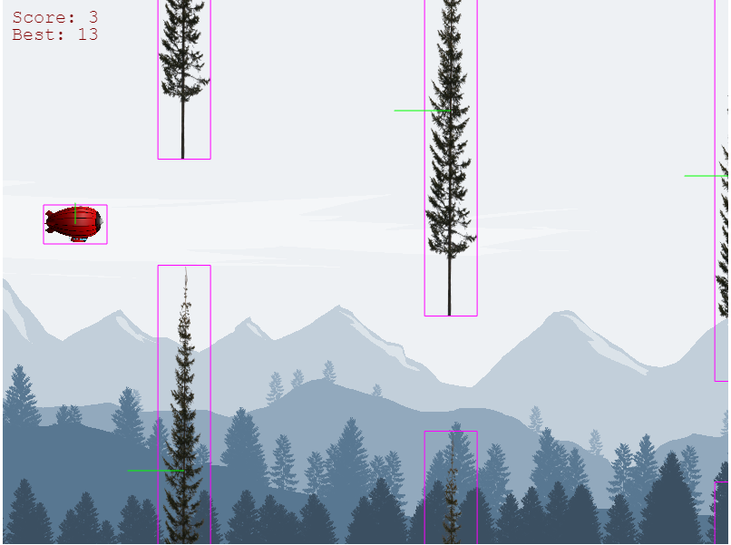
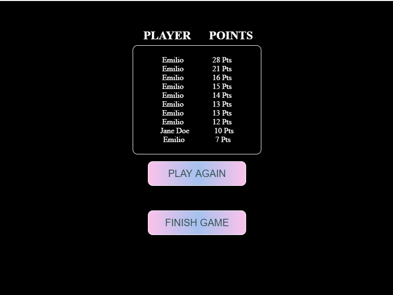
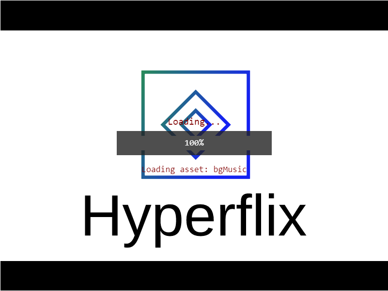
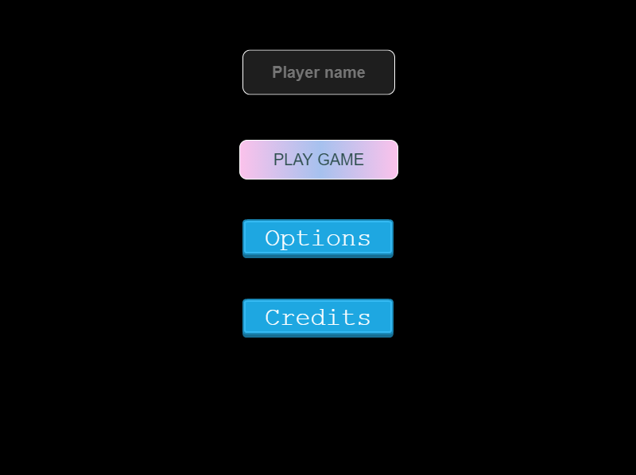

# Hyperflix - Zeppelin

This game is based on an old game named "flappy bird."
The gamer will try to avoid all the trees as possible while driving a Zeppelin by clicking or pressing "SPACE."
The score is displayed at the top-left area of the screen. Plus, the gamer could stop the music or view credits in the menu section of the game.

## Live Version

This game is deployed in Netifly website.
You can access by clicking the following [link](https://laughing-banach-473f29.netlify.app/dist/)

## Game Design

## Technologies

- HTML
- CSS
- Webpack
- Phaser-3
- Babel
- Javascript
- Leaderboard API

## Installation

Use your terminal to run all the command lines marked below. Follow each step carefully to prevent typos.

-[x] 1.- Click on the install or download button under the repository name and copy the URL by clicking on the icon.

-[x] 2.- Open your terminal. To open the terminal, press Ctrl+Alt+T(Ubuntu) or if you are using Mac Command + Space and type in 'Terminal'.

-[x] 3.- Navigate to the location in your computer where you want the repo to be cloned. Remeber that you have to type 'cd' first.

-[x] 4.- Type git clone and paste the url you copied on step one.

-[x] 5.- Install all your project dependencies. Be sure you have [Node.js](https://nodejs.org/en/) installed.
> npm install

-[x] 6.- Run your webpack server.
> npm run start

## Testing
- Install project dependencies. Run the following command-line in your terminal
> npm install

- Run testing with following command in your terminal.
> npm run test

## Authors

👤 **Emilio Contreras**

- Github: [@emiliocm9](https://github.com/emiliocm9)
- Twitter: [@emiliocm31](https://twitter.com/emiliocm31)
- Email: [email](emilio.contreras97@gmail.com)
- Linkedin: [@linkedin](https://www.linkedin.com/in/emiliocm31/)
- Portfolio: [emiliocm.com](https://emiliocm9.github.io/)

## 🤝 Contributing

Contributions, issues and feature requests are welcome!

Feel free to check the [issues page](issues/).

## Show your support

Give a ⭐️ if you like this project!

## Acknowledgments

- Project inspired by Microverse Program.

